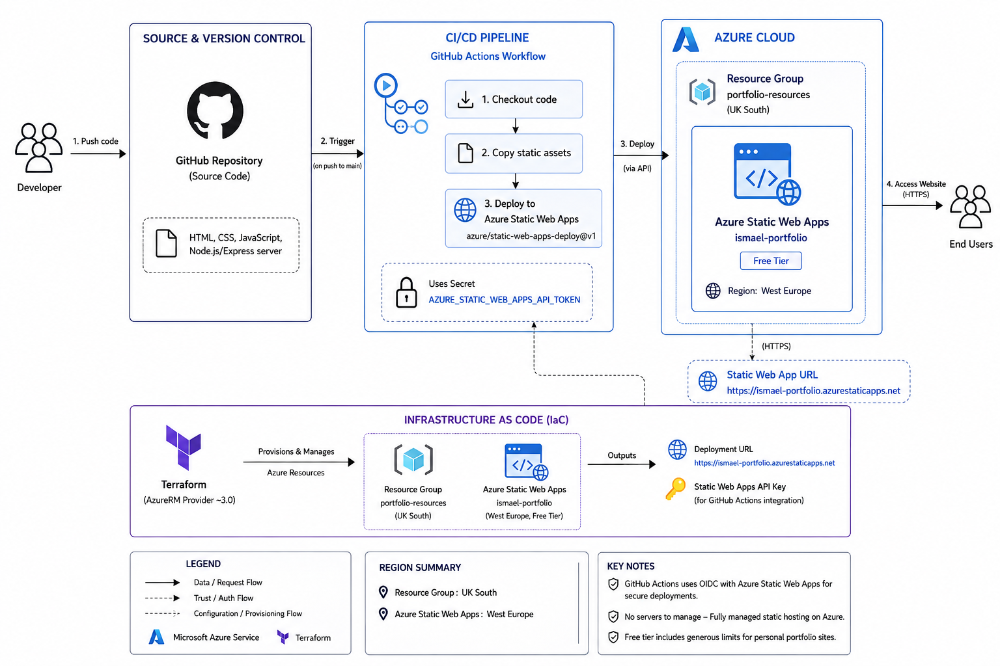

# Portfolio Website

A professional portfolio website showcasing DevOps skills, built with modern web technologies and deployed using Infrastructure as Code (IaC) with Terraform. This project demonstrates cloud deployment on Azure Static Web Apps and automated CI/CD pipelines with GitHub Actions.

## Live Application

The application is deployed and accessible at:

[https://www.ismaelyasin.site](https://www.ismaelyasin.site)

## Overview 

This project showcases a production ready deployment of a static portfolio website on Azure infrastructure. The site displays professional experience, skills, projects, and certifications in a modern responsive design with dark and light mode. The entire infrastructure is defined through Terraform, and deployments are automated through GitHub Actions workflows on every push to the main branch.

## Architecture

The system follows a simple and efficient deployment pattern with clear separation between development workflow and user access. The infrastructure is provisioned in Azure (UK South / West Europe regions) and leverages Azure Static Web Apps for global CDN distribution and automatic HTTPS.

### Architecture Diagram



The deployment architecture includes:

**Developer Workflow** Code changes pushed to GitHub trigger automated workflows that deploy the static site to Azure Static Web Apps. Terraform provisions the Azure infrastructure (Resource Group and Static Web App) for initial setup.

**User Access Flow** Users access the portfolio through the Azure Static Web Apps URL. The platform provides global CDN distribution, automatic HTTPS, and instant cache invalidation on new deployments.

**Infrastructure Components** Terraform manages the Azure Resource Group and Static Web App resource. GitHub Actions handles the build and deployment step, copying favicons to the app folder and uploading the static content to Azure.

## Technology Stack

**Frontend** HTML, CSS, and JavaScript with a responsive design. Dark and light theme toggle and modern UI with smooth animations.

**Local Development** Node.js with Express.js for serving the site during development.

**Infrastructure** Terraform manages all Azure resources including Resource Group and Static Web App. The configuration uses the Azure provider (~> 3.0).

**CI/CD** GitHub Actions workflows handle deployment. The Azure Static Web Apps deploy action builds and deploys on every push to main. API tokens are stored securely in GitHub Secrets.

**Hosting** Azure Static Web Apps provides global CDN, automatic HTTPS, and free tier hosting for static sites.

## Features

The portfolio provides several sections to showcase professional work:

- **Hero Section** introduces the developer with a profile photo and tagline.
- **About** provides a brief professional summary and background.
- **Skills** displays technical skills as pill style tags with dark and light mode support.
- **Work Experience** timelines professional roles and responsibilities.
- **Projects** cards showcase DevOps projects with tags and source code links.
- **Bootcamps** highlights completed training programs and certifications.
- **Certifications** displays earned credentials with badges.
- **Contact** section with links to GitHub, LinkedIn, and email.
- **Theme Toggle** switches between dark and light mode.
- **Responsive Design** adapts to mobile, tablet, and desktop viewports.

## Project Structure

```
portf-1/
├── app/                    # Application code
│   ├── index.html          # Main HTML file
│   ├── server.js           # Express server for local development
│   └── images/             # Profile and logo images
├── public/                 # Static assets at root
│   ├── favicon.ico         # Favicon
│   ├── favicon-16x16.png   # 16x16 favicon
│   └── favicon-32x32.png   # 32x32 favicon
├── terraform/              # Infrastructure as Code
│   └── main.tf             # Azure Resource Group and Static Web App
├── scripts/                # Utility scripts
│   └── deploy.sh           # Terraform deployment automation
├── images/                 # README assets
│   ├── architecture-diagram.png
│   └── screenshot.jpg
├── .github/
│   └── workflows/          # GitHub Actions CI/CD pipelines
│       ├── azure-static-web-apps.yml
│       └── deploy.yml
├── package.json
└── README.md
```

## Getting Started

### Prerequisites

An Azure subscription, Node.js (v14 or higher), Terraform installed locally, and a GitHub repository with Actions enabled.

### Initial Setup

Clone the repository and navigate to the project directory. Install dependencies with `npm install`. To run locally, execute `npm start` and open http://localhost:3000 in your browser. For infrastructure, navigate to the terraform directory, copy or configure variables as needed, then run `terraform init`, `terraform plan -out=tfplan`, and `terraform apply tfplan`. Alternatively use `bash scripts/deploy.sh`. After applying Terraform, add the output `AZURE_STATIC_WEB_APPS_API_TOKEN` to your GitHub repository secrets.

### Deployment

After initial setup, deployments happen automatically. Push code to the main branch and GitHub Actions will copy favicons to the app folder and deploy the static content to Azure Static Web Apps. For manual deployment, install the Azure Static Web Apps CLI and run `swa deploy ./app --env production --deployment-token <YOUR_API_TOKEN>`.

## CI/CD Pipeline

The deployment pipeline consists of workflows that run on every push to main and on pull requests.

**Deploy Workflow**

Checks out the repository, copies favicons from `public/` to `app/` for inclusion in the deployment, and uses the Azure Static Web Apps deploy action to upload the app folder contents. The action builds and deploys the static site to Azure with automatic cache invalidation.

**Close Pull Request Job**

When a pull request is closed, the workflow runs the close action to clean up preview environments.

## Learning Curve and Challenges

Building this project involved learning several new concepts and overcoming various challenges.

**Infrastructure as Code**

Using Terraform for Azure required understanding the Azure provider, resource definitions, and outputs. Configuring the Static Web App with the correct SKU and linking the API key for GitHub integration took iteration.

**GitHub Actions Integration**

Connecting GitHub Actions to Azure Static Web Apps required configuring the deploy action with `app_location`, handling the API token securely in secrets, and ensuring the folder structure matched Azure's expectations.

**Static Site Structure**

Coordinating the app and public folder structure so that favicons and assets are correctly copied before deployment required understanding the Azure Static Web Apps build process.

**Secrets Management**

Managing the Azure API token securely in GitHub Secrets and ensuring it was never exposed in logs or code was important for security.

## Future Improvements

Several enhancements could improve the project further.

**Custom Domain**

Adding a custom domain (e.g., ismaelyasin.dev) with Azure Static Web Apps custom domains and SSL would provide a more professional URL.

**Analytics**

Integrating analytics (e.g., Azure Application Insights or privacy friendly alternatives) would provide insights into visitor behaviour and page performance.

**Performance Optimization**

Implementing image optimization, lazy loading, and further minification could improve load times and Core Web Vitals.

**Automated Testing**

Adding Lighthouse CI or visual regression tests in the GitHub Actions pipeline would catch quality issues before deployment.

**Multi Environment Support**

Supporting staging and production environments with separate Azure Static Web Apps instances would enable safer deployments.

**Enhanced Monitoring**

Adding Azure Monitor alerts for deployment failures or downtime would improve operational visibility.

## Infrastructure Details

The infrastructure is designed for simplicity and cost effectiveness on Azure's free tier.

**Resource Group**

The portfolio-resources resource group in UK South organizes all portfolio related resources. Terraform manages the lifecycle.

**Static Web App**

The Azure Static Web App runs in West Europe and provides global CDN, automatic HTTPS, and instant deployments. The Free tier supports custom domains and unlimited bandwidth for static content.

**CI/CD**

GitHub Actions uses the Azure Static Web Apps API token for authenticated deployments. The workflow is triggered on push and pull request events.

## License

MIT

## Author

**Ismael Yasin**

- Portfolio: [Live Site](https://www.ismaelyasin.site)
- LinkedIn: [ismael-yasin-782bbb320](https://linkedin.com/in/ismael-yasin-782bbb320/)
- GitHub: [@ismaelyasindev](https://github.com/ismaelyasindev)
